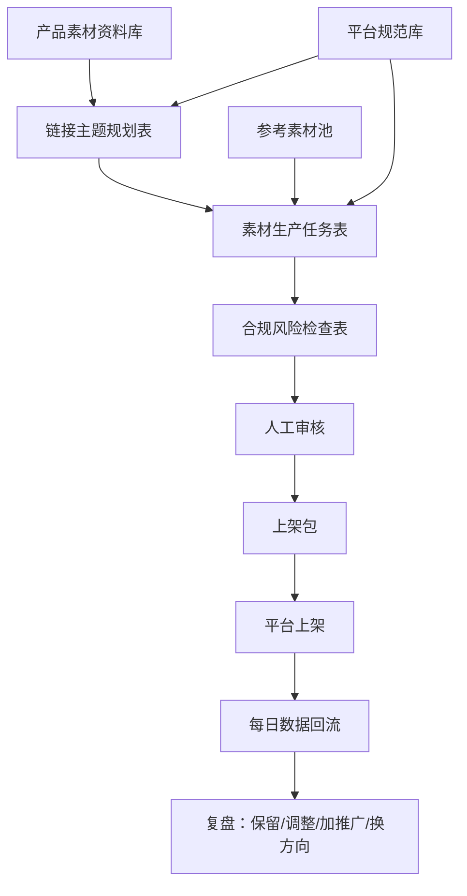

# 100链接/天素材生产自动化计划

> 生成时间：2026-06-18 20:09:47
>
> 目标：让 1 个人每天能够推进 10 款产品、100 条不同主题风格链接的素材生产与上架准备。

## 0. 关键目标

🔴 产能目标：每天 10 款产品，每款产品 10 条主题链接，共 100 条链接。

🔴 素材要求：100 条链接的素材必须当日产出，不得复用同一套主图/详情页/笔记图主题。

🔴 合规要求：素材中不能出现产品相关违禁词、平台违禁词、医疗化夸大表达、绝对化表达、外部引流信息、低价误导和资质超范围宣传。

🔴 人工边界：自动化系统负责生成、拆任务、检查、归档；人负责产品准入、合规确认、最终上架确认。

## 1. 新计划飞书表

本计划与原有 CD 级产品赛马表隔离，所有表名统一使用 `100链接计划-` 前缀。

| 表格 | 用途 | 链接 |
| --- | --- | --- |
| 100链接计划-产品素材资料库 | 存放每款产品的基础资料、SKU、资质、禁用词和可宣传范围 | [打开](https://kcnp7dt4adf2.feishu.cn/wiki/MsTowmWALiLUaxkxKZrcdScCn2c?table=tblYmnlKXoPqGA09) |
| 100链接计划-链接主题规划表 | 为每款产品规划 10 条不同主题链接 | [打开](https://kcnp7dt4adf2.feishu.cn/wiki/MsTowmWALiLUaxkxKZrcdScCn2c?table=tblPHPcAoTHKW0vT) |
| 100链接计划-素材生产任务表 | 把每条链接拆成图片、视频、详情页、资质图等具体生产任务 | [打开](https://kcnp7dt4adf2.feishu.cn/wiki/MsTowmWALiLUaxkxKZrcdScCn2c?table=tblSckvB2c52I0qZ) |
| 100链接计划-参考素材池 | 存放竞品图、行业优秀图、内部历史高转化素材、场景参考图，用于提高生图一次成功率 | [打开](https://kcnp7dt4adf2.feishu.cn/wiki/MsTowmWALiLUaxkxKZrcdScCn2c?table=tblYsSuDo01wHvGx) |
| 100链接计划-平台规范库 | 提前录入各平台对医疗器械/消毒产品等涉及品类的规范，生成前先做自我审核 | [打开](https://kcnp7dt4adf2.feishu.cn/wiki/MsTowmWALiLUaxkxKZrcdScCn2c?table=tblVFxp8DZaaI3Lu) |
| 100链接计划-合规风险检查表 | 记录每条素材的风险命中、替代表达和人工处理意见 | [打开](https://kcnp7dt4adf2.feishu.cn/wiki/MsTowmWALiLUaxkxKZrcdScCn2c?table=tblNRdJmXrL4Q7b2) |

## 2. 总体流程

## 3. 环节一：产品素材资料库

### 3.1 目标

把 10 款产品当天生产所需的所有基础信息一次性录入，避免后续每条链接反复询问资料。

### 3.2 输入内容

🔴 必填输入：

- 款式编码：你们内部对 SPU 的代码称为“款式编码”，这是后续链接、素材、合规、数据回流的主键。
- 标准产品名称：必须填写标准产品名称，且要和实际上架商品名称保持一致。
- 商品标题（埋词）：不等同于标准产品名称，可根据平台、用户搜索词、核心卖点和类目关键词生成；如果暂时没有标题，可以先留空，由主题规划环节生成候选标题。
- 产品类目：只需要标记“医疗器械”或“消毒产品”等当前实际涉及品类；其他暂不涉及的类目不要扩展，避免规则和字段过重。
- 平台：天猫、小红书、抖音、快手等。
- SKU数量：决定需要生成多少张 SKU 图。
- SKU明细：每个 SKU 的规格、颜色、数量、价格、组合方式。
- 规格/型号/数量：必须与详情页、SKU 图、标题保持一致。
- 材质/成分：用于生成详情页和合规检查。
- 基础卖点：只写真实、可验证、能证明的卖点。
- 适用人群：不能超范围宣传。
- 适用场景：用于生成不同主题链接。
- 白底图文件夹：用于基础图生产。
- 透明底图文件夹：用于抠图、组合图生产。
- 产品实拍文件夹：用于场景图、笔记图、详情页。
- 注册证/资质文件夹：医疗器械等产品必须填写。
- 可宣传范围：结合平台规范库和产品资质，提前写清楚允许表达的内容。
- 禁止宣传范围：结合平台规范库和产品资质，提前写清楚不能写的功效、场景、词汇。
- 产品禁用词：产品维度禁用词。
- 资质审核状态：未审核、通过、驳回、需补充。
- 产品准入结论：可生产、需补资料、禁止生产。

### 3.3 输出内容

产品素材资料库输出的是“可被自动化调用的产品资料包”：

- 可生成链接主题的产品基础信息。
- 可生成素材文案的卖点、场景、人群。
- 可生成 SKU 图的 SKU 明细。
- 可进行合规检查的禁用词和可宣传范围。
- 可上架使用的资质图来源。

### 3.4 生成前人工参与点

🔴 人工审核要前置：不是等输出内容后才判断，而是在 AI 生成主题、文案、提示词之前先输入规则和边界。

生成前必须完成：

- 在 `100链接计划-平台规范库` 中录入目标平台对医疗器械/消毒产品等涉及品类的规范。
- 在产品素材资料库中写清楚该产品的可宣传范围、禁止宣传范围和产品禁用词。
- 医疗器械产品必须确认注册证、备案凭证、说明书、标签标识是否完整。
- 注册证宣传范围必须先和产品卖点做一次对齐，不能等素材生成后再补。
- SKU 是否存在低价引流、规格混淆、赠品误导，要在主题规划前先确认。
- 产品是否允许在目标平台发布、推广、销售，要在生成前确认。

审核标准不要过度收紧：

- 明确违规内容：直接禁止生成。
- 明确合规内容：允许进入自动生成。
- 有争议内容：允许保留为候选表达，但必须在后续表中标记为 `🔴争议待审`，由人工重点确认。

## 4. 环节二：链接主题规划表

### 4.1 目标

每款产品生成 10 条不同主题链接，确保 100 条链接不是重复素材，而是不同主题、不同人群、不同场景、不同测试假设。

### 4.2 输入内容

来自产品素材资料库：

- 款式编码
- 标准产品名称
- 商品标题（埋词）
- 平台
- SKU数量
- 基础卖点
- 适用人群
- 适用场景
- 可宣传范围
- 禁止宣传范围

来自平台规范库：

- 平台
- 品类范围
- 是否医疗器械/消毒产品
- 可宣传表达
- 禁止表达
- 争议表达
- 争议处理方式
- 资质要求
- 主图限制
- 详情页限制
- 视频/口播限制
- 价格/SKU限制
- 生成前自检要求
- 人工重点审核项

自动化需要生成或填写：

- 主题ID
- 链接序号：1-10
- 主题名称
- 主题风格
- 目标人群
- 使用场景
- 核心痛点
- 核心卖点
- 信任背书
- 价格/促销方向
- 需要生成方图数：默认 5
- 需要生成长图数：默认 5
- 需要生成详情页数：默认 6
- 需要生成笔记图数：默认 3
- 需要生成视频数：默认 1
- SKU图数量：根据产品 SKU 数量自动计算
- 基础图数量：默认 2，白底图 1 张、透明底图 1 张
- 场景图数量：默认 1
- 资质图数量：医疗器械默认 1
- 主题合规注意事项
- 人工确认状态
- 计划状态

### 4.3 输出内容

链接主题规划表输出的是“100 条链接测试假设”。

每一行代表一个链接方向，例如：

- 家庭常备方向
- 办公久坐方向
- 运动恢复方向
- 价格促销方向
- 资质信任方向
- 使用教程方向
- 场景痛点方向
- 人群细分方向
- 应急备用方向
- 笔记种草方向

### 4.4 人工参与点

🔴 必须人工确认：

- 主题是否超出产品真实用途。
- 医疗器械是否出现治疗、康复、止痛、修复等超范围方向。
- 是否存在平台不允许的目标人群或使用场景。

## 4A. 环节二前置：平台规范库

### 4A.1 目标

把平台规则前置给 AI，让 AI 在生成主题、文案、画面描述、生图提示词之前先做自我审核，而不是等素材生成后才发现违规。

### 4A.2 输入内容

🔴 只录入当前实际涉及品类的规范，暂时重点是医疗器械和消毒产品，不要把暂不涉及的食品、母婴、化妆品等规则混进来。

每条平台规范应包含：

- 规范ID
- 平台
- 品类范围
- 是否医疗器械/消毒产品
- 可宣传表达
- 禁止表达
- 争议表达
- 争议处理方式
- 资质要求
- 主图限制
- 详情页限制
- 视频/口播限制
- 价格/SKU限制
- 审核严格度
- 生成前自检要求
- 人工重点审核项
- 规范来源/链接
- 生效状态

### 4A.3 输出内容

平台规范库输出的是“生成前约束包”：

- 主题规划时用来排除明显违规方向。
- 文案生成时用来限制禁用词和功效表达。
- 生图提示词生成时用来限制画面、场景和资质展示方式。
- 合规风险检查时用来判断 P0 阻断、P1 争议待审、P2 提醒。

### 4A.4 审核标准与争议标注

审核不要太狠，采用三档：

| 类型 | 处理方式 |
| --- | --- |
| 明确违规 | 不生成，或生成时自动改写为合规表达 |
| 明确合规 | 正常生成 |
| 有争议 | 保留候选，但必须标记 `🔴争议待审`，并写入人工重点审核项 |

争议内容示例：

- 可能接近功效承诺，但也可能属于合理使用场景描述。
- 可能接近医疗化表达，但如果有注册证范围支撑，人工可判断是否保留。
- 价格促销表达可能合规，但需要确认是否与实际 SKU、优惠、库存一致。
- 详情页资质展示方式可能合规，但需要确认是否真实、清晰、未超范围。

## 5. 环节三：素材生产任务表

### 5.1 目标

把 100 条链接拆成可以批量生产的任务。单条链接最少会拆成：

- 方图 5 张
- 长图 5 张
- SKU 图 N 张
- 详情页 6 张
- 产品视频 1 条
- 白底图 1 张
- 透明底图 1 张
- 场景图 1 张
- 笔记图 3 张
- 资质图 1 张

### 5.2 单条链接最低任务数

不含 SKU 图时，单条链接最低任务数为：

| 素材类型 | 数量 |
| --- | ---: |
| 方图 | 5 |
| 长图 | 5 |
| 详情页 | 6 |
| 产品视频 | 1 |
| 白底图 | 1 |
| 透明底图 | 1 |
| 场景图 | 1 |
| 笔记图 | 3 |
| 资质图 | 1 |
| 合计 | 24 |

100 条链接最低为 2400 个素材任务，另加 SKU 图。

### 5.2.1 电商图片尺寸标准

🔴 所有素材生产任务必须写明尺寸，避免后续返工。

| 素材类型 | 标准尺寸 | 说明 |
| --- | --- | --- |
| 方图 | 1440×1440 | 用于主图、SKU图、白底图、透明底图、场景图、部分笔记图。 |
| 长图 | 1440×1920 | 用于竖版主图、长图测试、小红书/内容型展示。 |
| 详情页 | 宽度 1440，单张长度不超过 2880 | 详情页不要生成超长单图，按模块拆成 6 张以上，平台上传时不需要再裁剪。 |
| 产品视频 | 15 秒左右 | 口播讲解视频，建议 9:16 竖版，首屏 2 秒必须出现产品和核心卖点。 |

### 5.2.2 详情页连续性要求

🔴 详情页不是几张图硬拼，必须看起来像一整张连续长图。

详情页生成时必须遵守：

- 每张详情页图片的顶部和底部要有视觉延续，例如统一背景色、统一分割线、统一模块标题样式。
- 上一张的结尾要自然引出下一张内容，避免“突然换场景、突然换风格、突然换文案口吻”。
- 模块顺序建议固定为：痛点场景 → 产品解决方案 → 核心卖点 → 使用方法/SKU规格 → 信任与资质 → 品牌背书。
- 详情页末尾统一加入恒品品牌简介背书内容，表达要稳妥，不得出现绝对化和功效承诺。

建议统一品牌背书文案：

> 恒品关注日常生活与家庭护理场景，围绕用户真实使用需求，持续提供清晰、实用、可靠的产品选择。商品信息以页面展示、产品标签、说明书及相关资质文件为准，请按说明合理使用。

### 5.3 输入内容

来自链接主题规划表：

- 主题ID
- 款式编码
- 标准产品名称
- 商品标题（埋词）
- 平台
- 链接序号
- 主题名称
- 主题风格
- 目标人群
- 使用场景
- 核心痛点
- 核心卖点
- 信任背书
- 价格/促销方向
- 各类型素材数量

来自产品素材资料库：

- 产品实拍图
- 产品参考图路径
- 场景参考图路径
- 匹配参考素材ID
- 参考素材使用方式
- 白底图
- 透明底图
- SKU 明细
- 注册证/资质图
- 禁用词
- 可宣传范围

来自平台规范库：

- 可宣传表达
- 禁止表达
- 争议表达
- 主图限制
- 详情页限制
- 视频/口播限制
- 价格/SKU限制
- 生成前自检要求
- 人工重点审核项

### 5.4 输出内容

素材生产任务表每一行是一项具体生产任务：

- 任务ID
- 主题ID
- 款式编码
- 标准产品名称
- 商品标题（埋词）
- 平台
- 链接序号
- 素材类型
- 素材序号
- 素材规格
- 图片尺寸
- 主文案
- 辅助文案
- 画面描述
- 设计要求
- 详情页衔接要求
- 品牌背书模块
- 口播脚本
- 关联 SKU
- 引用资质
- 产品参考图路径
- 场景参考图路径
- 匹配参考素材ID
- 参考素材使用方式
- 生图提示词
- ChatGPT对话批次
- 建议单轮生成数量
- 输出文件名
- 输出文件夹
- 下载文件路径
- 合规初检状态
- 人工审核状态
- 人工质检结论
- 制作状态
- 上架包状态

### 5.5 人工参与点

🔴 人不应该逐条写文案。

人只处理：

- 合规初检命中的任务。
- 医疗器械资质展示任务。
- 视频脚本中涉及产品功效的任务。
- 最终上架前抽检。

### 5.6 ChatGPT 网页版生图落地流程

🔴 当前计划默认使用 ChatGPT 网页版生成图片，Codex 只负责规划、拆任务、写提示词、归档结果，不作为主要出图工具。

原因：

- Codex 内置生图额度适合少量验证，不适合每天 100 条链接的大规模图片生产。
- ChatGPT 网页版更适合人工监督式批量生图，但网页端额度和限制会随账号、模型、时间和系统负载变化。
- 自动化脚本只能作为“辅助操作”，不应绕过平台限制，也不应无人值守高频刷请求。

建议落地流程：

1. 本地脚本读取 `100链接计划-素材生产任务表` 中 `制作状态=待制作` 且 `合规初检状态=通过` 的任务。
2. 脚本为每个任务准备一个本地文件夹，放入产品参考图、场景参考图、资质图、提示词文本。
3. 脚本打开 ChatGPT 网页，新建对话。
4. 脚本上传产品参考图和必要场景参考图。
5. 脚本填入 `生图提示词`。
6. 人工确认提示词和参考图无误后，点击生成。
7. 等待生成完成。
8. 脚本将生成图片下载到任务对应文件夹，并把 `下载文件路径` 写回表格。
9. 人工判断图片是否合格，填写 `人工质检结论`。
10. 完成后再进入下一个任务或下一批对话。

### 5.7 ChatGPT 生图批次规划

🔴 不建议一个对话里生成整条链接的所有素材。

原因：

- 方图、长图、详情页、笔记图、SKU 图的构图目标不同，放在同一轮里容易互相污染风格。
- 详情页需要连续性，应该单独成组生成。
- 白底图、透明底图、资质图不应该和营销场景图混在一个对话里。

建议按素材类型拆对话：

| 对话批次 | 内容 | 建议单轮生成数量 | 是否需要参考图 | 是否建议独立对话 |
| --- | --- | ---: | --- | --- |
| A | 5 张方图 | 1-2 张/轮 | 必须上传产品参考图，可选场景参考图 | 是 |
| B | 5 张长图 | 1-2 张/轮 | 必须上传产品参考图，可选场景参考图 | 是 |
| C | 详情页 6 张 | 1 张/轮，按顺序生成 | 必须上传产品参考图，必要时上传品牌/资质参考图 | 是 |
| D | SKU 图 | 每个 SKU 1 张 | 必须上传产品/SKU参考图 | 是 |
| E | 白底图、透明底图 | 1-2 张/轮 | 必须上传清晰产品图 | 是 |
| F | 场景图 | 1 张/轮 | 必须上传产品图，最好上传场景参考图 | 是 |
| G | 笔记图 3 张 | 1-2 张/轮 | 必须上传产品图，可上传小红书风格参考图 | 是 |
| H | 注册证/资质图 | 不建议 AI 生成，只做真实资质排版 | 必须使用真实资质文件 | 必须独立处理 |

单条链接建议最少 7-8 个对话批次。

100 条链接如果全部用网页端生图，理论对话量会很大，因此实际执行时应采用“分层生产”：

- 第一层：基础图、资质图、SKU图尽量模板化，不每条链接重新生成。
- 第二层：主图、长图、笔记图按主题生成，是差异化重点。
- 第三层：详情页按产品维度复用结构，只替换主题模块和首屏表达。

### 5.8 参考图准备要求

每个生图任务至少要有：

- 产品本身参考图：清晰、无遮挡、正面/侧面/包装图优先。
- 场景参考图：能表达目标使用场景，例如家庭、办公室、旅行、运动、穿搭、口腔护理、清洁等。
- 风格参考图：用于约束主图风格，例如天猫电商主图、小红书笔记图、详情页模块图。

🔴 如果没有参考图，任务状态应保持“资料不足”，不要进入生图。

### 5.9 并行对话建议

如果使用 ChatGPT 网页版，建议采用“少量并行、人工监督”的方式：

- 单人操作建议同时开 2-3 个对话窗口，不建议更多。
- 每个窗口只处理同一产品、同一素材类型，减少风格混乱。
- 一个对话失败或效果跑偏时，不要继续在同一对话里硬修，建议新开对话。
- 每批完成后先下载、命名、归档，再进入下一批。

🔴 不建议做无人值守高频自动点击生成。这样容易触发网页风控，也会让错误素材批量扩散。

### 5.10 提高生图一次成功率：参考素材池

🔴 生图不能只靠文字提示词。必须建立参考素材池，用参考图约束构图、场景、风格和信息层级。

参考素材池的作用：

- 降低“抽卡”次数。
- 让不同链接的素材有方向差异，但不至于风格完全失控。
- 让 AI 更容易理解主图构图、详情页模块、笔记图风格。
- 把成功素材沉淀成可复用资产。

参考素材池可包含：

- 同类竞品主图：只用于学习构图、信息层级、场景表达，不得复制商品主体、品牌、商标、水印、专利设计和具体文案。
- 行业优秀主图：用于参考画面结构、卖点排布、色调和布局。
- 内部历史高转化素材：优先级最高，可以更直接复用结构和风格。
- 场景参考图：家庭、办公室、旅行、运动、穿搭、口腔护理、清洁等场景。
- 详情页模块参考：痛点模块、卖点模块、使用方法模块、规格模块、资质模块、品牌背书模块。

🔴 竞品图可以作为参考，但不能作为复制对象。

竞品参考图使用边界：

- 可以参考：构图逻辑、信息层级、场景类型、色彩氛围、主次关系。
- 不可以复制：品牌标识、商标、包装外观、人物肖像、原图背景、具体文案、专利外观、独有设计。
- 不可以上传带明显水印、店铺名、平台标识、二维码、联系方式的图作为最终素材。
- 如果参考图来自竞品平台页面，只能作为内部生产参考，不得直接发布或局部改图后发布。

参考素材池字段应记录：

- 参考素材ID
- 参考素材名称
- 素材来源：内部素材 / 竞品参考 / 行业参考 / 场景参考
- 来源链接/文件路径
- 适用品类
- 适用平台
- 适用素材类型：方图、长图、详情页、笔记图、场景图等
- 适用主题方向
- 参考用途：构图参考、场景参考、色调参考、信息层级参考、详情页衔接参考
- 画面结构标签
- 风格标签
- 色调标签
- 可借鉴点
- 禁止复制点
- 版权/授权状态
- 合规审核状态

### 5.11 自动匹配参考素材的流程

当生成素材任务时，Agent 应自动从参考素材池选择参考图：

1. 根据产品类目匹配 `适用品类`。
2. 根据平台匹配 `适用平台`。
3. 根据素材类型匹配 `适用素材类型`。
4. 根据主题方向匹配 `适用主题方向`。
5. 优先选择 `版权/授权状态=内部可用` 或 `内部素材`。
6. 竞品参考只在没有内部参考时使用，并且必须写明 `禁止复制点`。
7. 将选中的参考素材ID写入素材生产任务表的 `匹配参考素材ID`。
8. 将使用方式写入 `参考素材使用方式`，例如：“只参考构图，不复制文案和品牌元素”。

推荐匹配优先级：

1. 内部历史高转化素材
2. 内部已审核通过素材
3. 行业优秀参考
4. 场景参考
5. 竞品参考

🔴 如果任务没有匹配到任何参考素材，生图提示词必须标记“参考不足”，人工可选择补参考图或降低本轮生产优先级。

### 5.12 抽卡次数控制

为了控制返工，建议给每类素材设置最大重试次数：

| 素材类型 | 首轮建议生成 | 最大重试 | 超过后动作 |
| --- | ---: | ---: | --- |
| 方图 | 1-2 张 | 2 轮 | 换参考图或换提示词结构 |
| 长图 | 1-2 张 | 2 轮 | 拆分画面元素，降低信息密度 |
| 详情页 | 1 张/模块 | 2 轮 | 固定模板后只替换局部内容 |
| SKU图 | 1 张/SKU | 1 轮 | 改用真实产品图排版 |
| 白底图/透明底图 | 1 张 | 1 轮 | 改用传统抠图工具 |
| 场景图 | 1 张 | 2 轮 | 更换场景参考图 |
| 笔记图 | 1-2 张 | 2 轮 | 更换风格参考图 |
| 资质图 | 0 张 AI 生成 | 0 轮 | 只使用真实资质文件排版 |

如果一项任务超过最大重试次数仍不合格，应写入 `人工质检结论=需人工处理`，不要继续盲目生成。

## 6. 环节四：合规风险检查表

### 6.1 目标

让程序自动筛出高风险内容，人只看高风险项。

### 6.2 输入内容

来自素材生产任务表：

- 主文案
- 辅助文案
- 画面描述
- 设计要求
- 口播脚本
- 引用资质

来自产品素材资料库：

- 产品禁用词
- 可宣传范围
- 禁止宣传范围
- 产品类目
- 资质审核状态

平台通用风险词库：

- 医疗化词汇
- 疾病治疗词汇
- 绝对化词汇
- 功效保证词汇
- 外部引流词汇
- 未授权背书词汇
- 低价误导词汇

### 6.3 输出内容

合规风险检查表输出：

- 风险ID
- 任务ID
- 款式编码
- 标准产品名称
- 商品标题（埋词）
- 平台
- 素材类型
- 检查对象
- 命中内容
- 风险类型
- 风险等级
- 风险说明
- 建议替代表达
- 是否阻断生产
- 人工处理意见
- 复检状态

### 6.4 风险等级

🔴 P0 阻断：不得进入制作或上架，必须修改。

典型情况：

- 治疗、治愈、根治、止痛、消炎等医疗化表达。
- 100%有效、一定有效、最强、第一等绝对化表达。
- 二维码、微信号、手机号、站外交易引导。
- 未授权医生、专家、机构背书。
- 资质图与宣传内容不一致。

🔴 P1 人工确认：可以进入待审，但必须人工确认。

典型情况：

- 医疗器械类目。
- 注册证展示。
- 功效边界模糊。
- 价格促销表达。
- SKU 组合复杂。

P2 提醒：可继续生产，但建议优化表达。

## 7. 每天生产节奏

### 上午 9:00 产品准备

输入：

- 10 款产品资料
- SKU
- 资质
- 产品图
- 禁用词

输出：

- 产品素材资料库完成 10 行。
- 产品准入状态为“可生产”。

### 上午 9:30 主题规划

输入：

- 产品素材资料库

输出：

- 100 条链接主题。
- 每条主题有明确人群、场景、痛点、卖点。

### 上午 10:00 素材任务拆解

输入：

- 链接主题规划表

输出：

- 2400+ 条素材任务。
- 每条任务有文案、画面描述、规格、文件名。

### 上午 11:00 合规初检

输入：

- 素材生产任务表
- 产品禁用词
- 平台禁用词

输出：

- 合规风险检查表。
- P0 阻断项。
- P1 人工确认项。
- P2 提醒项。

### 下午 13:00 批量制作

输入：

- 通过初检的素材任务

输出：

- 图片素材
- 视频素材
- 详情页素材
- 资质图归档

### 下午 16:00 上架包组装

输入：

- 完成制作的素材文件
- 上架标题
- SKU
- 资质图

输出：

- 100 个上架包。
- 每个上架包对应一个主题ID。

### 下午 17:00 人工抽检与上架

输入：

- 上架包
- 合规风险检查表

输出：

- 可上架链接
- 驳回修改链接
- 已上架记录

## 8. 其他 Agent 执行说明

其他 Agent 接手时，应按以下顺序执行：

1. 读取 `100链接计划-产品素材资料库`。
2. 读取 `100链接计划-平台规范库`，只加载当前产品涉及品类的规范，例如医疗器械、消毒产品。
3. 只处理 `产品准入结论=可生产` 的产品。
4. 生成主题前，先根据平台规范库做自我审核，排除明确违规方向。
5. 每款产品生成 10 条主题，写入 `100链接计划-链接主题规划表`。
6. 对有争议但不明确违规的方向，标记 `🔴争议待审`，不要直接删除。
7. 每条主题拆解为素材任务，写入 `100链接计划-素材生产任务表`。
8. 从 `100链接计划-参考素材池` 中为每条任务匹配参考素材。
9. 把参考素材ID和参考方式写回 `素材生产任务表`。
10. 根据产品资料、平台规范、主题规划、参考素材生成生图提示词。
11. 对所有文案、画面描述、口播脚本、生图提示词做合规检查。
12. 命中风险的内容写入 `100链接计划-合规风险检查表`。
13. P0 风险必须阻断，P1/争议项必须等待人工确认。
14. 只有合规初检通过且人工审核通过的任务，才能进入制作和上架包。

## 9. 最低可运行版本

第一阶段不需要自动出图、自动上架。

最低可运行版本只需要做到：

1. 产品资料录入。
2. 100 条主题规划。
3. 2400+ 条素材生产任务拆解。
4. 文案和画面描述生成。
5. 合规风险表生成。
6. 人工审核后导出制作清单。

等这条链路跑顺，再接 AI 出图、视频生成、文件归档和平台上架。
